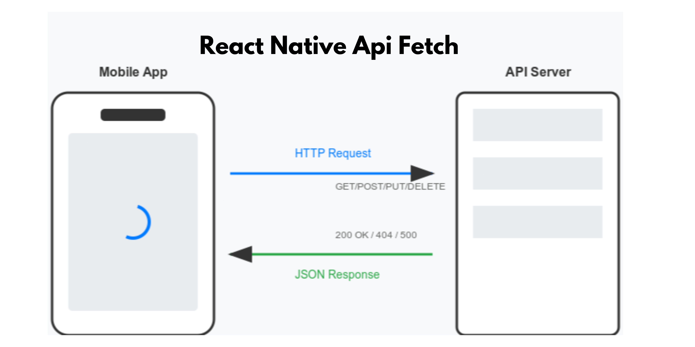

# FetchComponent and useFetch

This project contains two main utilities for handling API requests in a React Native environment: `FetchComponent` and `useFetch`. Both are designed to simplify fetching data from an API, manage loading states, handle caching, and allow retrying requests.

## Table of Contents

- [Introduction](#introduction)
- [Prerequisites](#prerequisites)
- [FetchComponent](#fetchcomponent)
  - [Usage](#usage)
  - [Props](#props)
- [useFetch Hook](#usefetch-hook)
  - [Usage](#usage-1)
  - [Returned Values](#returned-values)
- [Advantages](#advantages)

## Introduction

This project provides two methods to fetch data:

1. **`FetchComponent`**: A React Native component for fetching data that can be used directly in the component tree.
2. **`useFetch`**: A custom React hook that you can use to manage data fetching within your functional components.

Both methods include features like caching, error handling, and support for retrying requests. The caching mechanism uses `AsyncStorage` to save fetched data and avoid unnecessary network requests, improving the app's performance and reducing network load.

---

## Prerequisites

Before using `FetchComponent` or `useFetch`, you need to install the `@react-native-async-storage/async-storage` package, which is used for caching the fetched data.

Install the `@react-native-async-storage/async-storage` package using npm or yarn:

```bash
npm install @react-native-async-storage/async-storage
```

or with yarn:

```bash
yarn add @react-native-async-storage/async-storage
```

Follow the official [AsyncStorage installation guide](https://react-native-async-storage.github.io/async-storage/docs/install/) if you need platform-specific setup instructions.

---


## Installation

To install the package, you can use npm or yarn:

```bash
npm i react-native-api-fetch
```

or if you prefer yarn:

```bash
yarn add react-native-api-fetch
```


## FetchComponent

The `FetchComponent` is a React Native component designed to handle API requests. It can be used directly in the UI to fetch data from an API, display loading indicators, handle errors, and display the fetched data.

### Usage

```jsx
import {FetchComponent} from 'react-native-api-fetch'

const MyComponent = () => (
  <FetchComponent
    url="https://api.example.com/data"
    method="GET"
    cacheKey="example_data"
    cacheExpiration={60000}
    pollingInterval={30000}
    render={({ data, loading, error, retry }) => {
      if (loading) return <Text>Loading...</Text>;
      if (error) return <Text>Error: {error}</Text>;
      return (
        <View>
          <Text>Data: {JSON.stringify(data)}</Text>
          <Button title="Retry" onPress={retry} />
        </View>
      );
    }}
  />
);
```

### Props

- `url` (string): The API endpoint to fetch data from.
- `method` (string): The HTTP method to use (default is `GET`).
- `body` (object|null): The body of the request, typically for `POST`, `PUT`, or `PATCH` requests.
- `headers` (object): The headers for the request, default is `{ 'Content-Type': 'application/json' }`.
- `cacheKey` (string|null): The key to store the response in `AsyncStorage` for caching purposes.
- `cacheExpiration` (number): The expiration time for cached data in milliseconds. Default is `60000` (1 minute).
- `pollingInterval` (number|null): The interval (in milliseconds) at which to poll the API. If `null`, polling is disabled.
- `render` (function): A render prop function that receives an object with `data`, `loading`, `error`, and `retry` callback as arguments.
- `children` (function): Alternatively, you can pass a function as `children` that receives the same arguments as the `render` prop.

---

## useFetch Hook

The `useFetch` hook is a custom React hook that provides a simpler way to manage API requests within functional components. It is ideal for when you don't need to directly render components based on the fetch state, but you still want to control the data fetching logic.

### Usage

```jsx
import { useFetch } from 'react-native-api-fetch';


const MyComponent = () => {
  const { data, loading, error, retry } = useFetch({
    url: "https://api.example.com/data",
    method: "GET",
    cacheKey: "example_data",
    cacheExpiration: 60000,
    pollingInterval: 30000,
  });

  if (loading) return <Text>Loading...</Text>;
  if (error) return <Text>Error: {error}</Text>;
  return (
    <View>
      <Text>Data: {JSON.stringify(data)}</Text>
      <Button title="Retry" onPress={retry} />
    </View>
  );
};
```

### Returned Values

The `useFetch` hook returns an object containing:

- `data` (any|null): The data fetched from the API, or `null` if the data hasn't been loaded yet.
- `loading` (boolean): A flag indicating whether the request is in progress.
- `error` (string|null): The error message if the request failed, or `null` if no error occurred.
- `retry` (function): A function to retry the request.

---

## Advantages

1. **Caching**: Both `FetchComponent` and `useFetch` support caching with `AsyncStorage`. This reduces network load by reusing previously fetched data when it's still valid based on the expiration time.

2. **Polling**: You can set an interval to poll the API and refresh the data automatically. This is useful for data that changes frequently.

3. **Error Handling**: The components handle errors by displaying an error message and allowing users to retry the request.

4. **Abort Handling**: The requests are abortable, so you can cancel ongoing requests if the component unmounts or if new data is fetched before the old request completes.

5. **Flexible Rendering**: You can control how the fetched data is displayed by passing a custom `render` function or using the `children` function, giving you the flexibility to design the UI based on your requirements.

6. **Reusable Logic**: The `useFetch` hook encapsulates the logic of fetching, caching, and error handling, making it easy to reuse across components without duplicating code.

7. **Optimized User Experience**: The component shows a loading indicator while fetching data, handles errors gracefully, and offers a retry button for failed requests, leading to a smoother user experience.

---

## Conclusion

This project provides a simple and efficient way to handle API requests, caching, and polling in React Native. Whether you prefer a component-based approach (`FetchComponent`) or a hook-based approach (`useFetch`), both options provide a set of useful features like caching, polling, and error handling that will make managing network requests easier and more performant.
